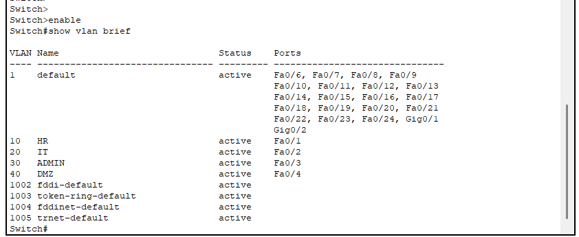
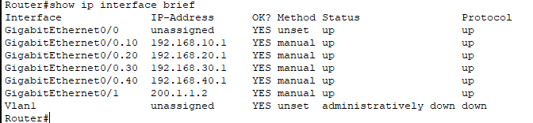
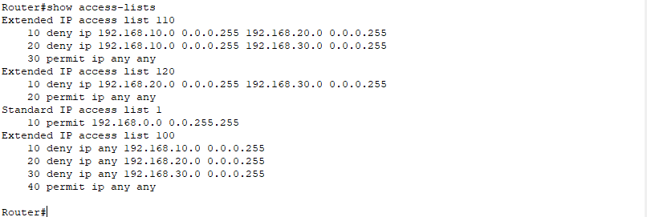
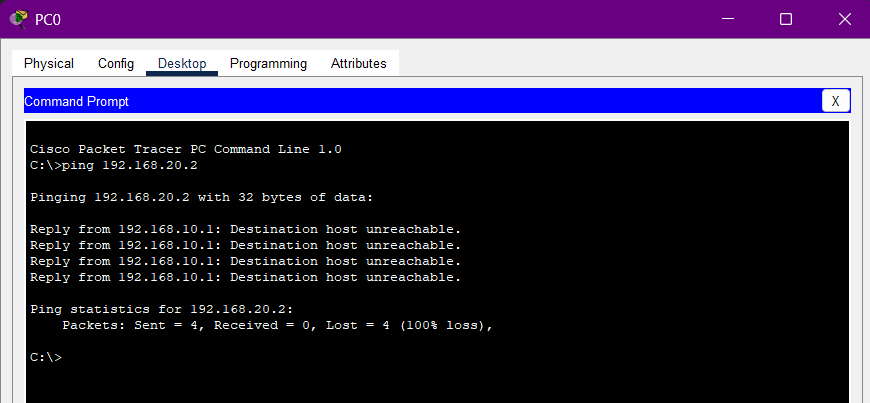
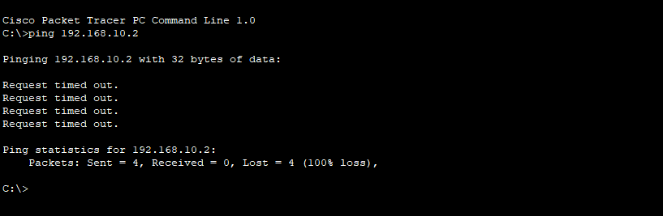
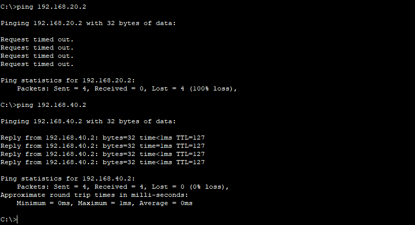
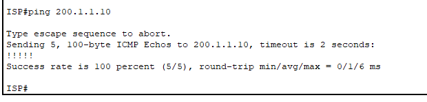

# Enterprise Network Security Simulation

## Overview
This project simulates a secure enterprise network using Cisco Packet Tracer. It demonstrates network segmentation, access control, and secure internet access using real-world networking concepts.

---

## Objectives
- Implement VLAN-based network segmentation
- Enable inter-VLAN routing
- Apply security using Access Control Lists (ACLs)
- Configure NAT for internet access
- Design a DMZ for hosting a public web server

---

## Network Architecture

- HR VLAN (10) → 192.168.10.0/24  
- IT VLAN (20) → 192.168.20.0/24  
- Admin VLAN (30) → 192.168.30.0/24  
- DMZ VLAN (40) → 192.168.40.0/24  

---

## Technologies Used

- VLAN Segmentation  
- Router-on-a-Stick (Inter-VLAN Routing)  
- Access Control Lists (ACLs)  
- NAT (PAT & Static NAT)  
- DMZ Architecture  
- Cisco Packet Tracer  

---

## Security Implementation

- HR cannot access IT or Admin networks  
- IT cannot access Admin network  
- Admin has full access  
- Internal users can access the DMZ server  
- External users can only access the DMZ server  
- Internal networks are protected from external access  

---

## NAT Configuration

- PAT used for internal users to access the internet  
- Static NAT used to expose the web server in DMZ  

---

## Testing & Validation

- Verified restricted communication using ACLs  
- Tested NAT translation and internet access  
- Confirmed DMZ accessibility from external network  
- Ensured internal network isolation from external traffic  

---

## Screenshots

### VLAN Configuration

Configured VLANs for HR, IT, Admin, and DMZ to logically segment the network and reduce unnecessary broadcast traffic.

### Inter-VLAN Routing

Enabled inter-VLAN communication using router subinterfaces, allowing controlled communication between different network segments.

### ACL Implementation

Applied ACLs to restrict unauthorized access between departments, ensuring HR and IT cannot access Admin resources while maintaining necessary connectivity.

### ACL Testing

HR to Admin is blocked.

HR to IT is blocked.

HR to DMZ works.

IT to Admin is blocked.

IT to DMZ works.

Admin to HR doesn't work and shows "request time out" as ACLs are stateless.

Admin to IT doesn't work and shows "request time out" as ACls are stateless.
Admin to DMZ works.

### NAT Configuration

Configured PAT to allow multiple internal devices to access external networks using a single public IP address.

### DMZ & Public Access

Deployed a DMZ to host a public web server using static NAT, allowing external access while protecting internal network resources.

---

## Project Files

- Cisco Packet Tracer file (.pkt)
- Configuration screenshots

---

## Outcome

Successfully designed and implemented a secure enterprise network with controlled access, public service exposure, and internal network protection.
